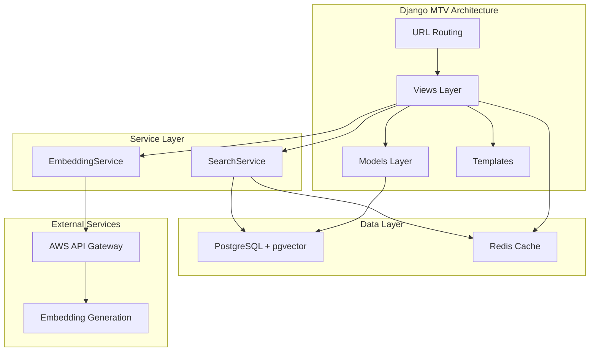

# HINO9 Django - AI News Platform

[](https://www.python.org/downloads/release/python-3110/)
[](https://www.djangoproject.com/)
[](https://github.com/pgvector/pgvector)
[](tests/)

> **Technical Portfolio Showcase**: Production-scale Django application demonstrating semantic search with pgvector, comprehensive testing infrastructure, and modern Python development practices.

---

## Project Overview

HINO9 Django is a news aggregation and search platform built to showcase advanced Django development patterns, AI-powered search capabilities, and production-ready testing methodologies.

**System Architecture**: The platform serves AI-processed news content with three search modes: semantic vector search using pgvector, full-text search with PostgreSQL, and hybrid search combining both approaches through RRF (Reciprocal Rank Fusion). Content is pre-processed by LLMs to generate headlines, summaries, and categorization tags, stored in a dual-table architecture optimized for both quick browsing and deep semantic search.

**Technical Sections:**

- [🚀 Quick Start](#quick-start)
- [✨ Platform Features](#platform-features)
- [🏗️ System Architecture](#system-architecture)
- [🔧 Technology Stack](#technology-stack)
- [🔍 Advanced Search Implementation](#advanced-search-implementation)
- [📁 Code Organization](#code-organization)
- [🧪 Testing Infrastructure](#testing-infrastructure)
- [🚢 Development & Deployment](#development-deployment)

---

<a id="quick-start"></a>
## 🚀 Quick Start

```bash
# Install dependencies and setup database
make setup

# Start development server on port 8300
make run
```

Visit http://localhost:8300 to see the application.

**Development Modes:**

```bash
# Development Mode (DEBUG=True, hot reload, no caching)
make run

# Production-Parity Mode (Gunicorn, Redis, WhiteNoise)
docker compose up
```

**Testing:**

```bash
# Unit Tests (PostgreSQL with Docker, 232 tests)
make test

# E2E Tests (Playwright, automated test server on port 8301)
make test-e2e
```

---

<a id="platform-features"></a>
## ✨ Platform Features

### Semantic Search Infrastructure

Django application implementing three search modes over LLM-processed news content. Vector similarity search uses PostgreSQL pgvector with 768-dimensional embeddings (nomic-embed-text-v1.5), full-text search leverages PostgreSQL tsvector with weighted field ranking, and hybrid search combines both using RRF fusion for optimal results.

### Dual-Table Search Architecture

Optimized database design with separate tables for different search patterns: `news` table stores pre-concatenated LLM content (headlines, summaries, bullets) with generated tsvector columns for fast browsing, while `articles` table contains full original content for deep semantic search. Both tables include vector embeddings and FTS indexes.

### Automated Testing Infrastructure

Comprehensive test suite with 257 passing tests across 6 categories. Includes automated PostgreSQL container management via `test_with_postgres.sh` script, Playwright E2E testing across multiple browsers, and SQLite fallback testing. Test coverage at 85% with automated coverage reporting.

### Production-Grade Caching

Intelligent cache strategy adapting to environment: DummyCache in DEBUG mode for development, LocMemCache for single-worker deployments, Redis with 7-day TTL for production. Includes automated cache clearing on deployment and strategic view-level caching.

### SEO Optimization

Complete SEO implementation with dynamic XML sitemaps, JSON-LD structured data on article pages, robots.txt configuration, canonical URLs, and comprehensive social media meta tags (Open Graph, Twitter Cards).

---

<a id="system-architecture"></a>
## 🏗️ System Architecture



### Django Application Structure

- **MTV Pattern**: Views organized by domain (articles, search, tags, utilities) with clear separation from business logic
- **Service Layer**: `SearchService` and `EmbeddingService` abstracting complex search algorithms and AWS integration
- **Model Layer**: Django ORM with pgvector fields for semantic embeddings and generated columns for FTS
- **Template Layer**: Tailwind CSS components with SEO optimization and responsive design

---

<a id="technology-stack"></a>
## 🔧 Technology Stack

- **Django 5.2.6**: Web framework with class-based and function-based views, admin interface, ORM
- **Python 3.12+**: Modern Python with type hints (MyPy strict mode) and async support
- **uv**: Fast Rust-based package manager replacing pip/pipenv/poetry
- **PostgreSQL + pgvector**: Vector similarity search with IVFFlat indexes on 768-dim embeddings
- **Redis 7**: Production caching and rate limiting (optional, falls back to LocMemCache)
- **AWS Integration**: API Gateway with IAM auth for embedding generation service
- **Gunicorn**: Production WSGI server with worker management and graceful reloads
- **WhiteNoise**: Static file serving optimized for production CDN integration
- **Tailwind CSS**: Utility-first CSS via django-tailwind with hot reload
- **Playwright**: E2E testing across Chromium, Firefox, and WebKit browsers
- **Docker**: Containerized development, testing, and production environments

### Code Quality Tools

- **Black**: Opinionated code formatting (88-character line length)
- **Ruff**: Fast linting replacing flake8, isort, and pylint
- **MyPy**: Static type checking with django-stubs integration
- **Coverage.py**: Code coverage reporting with 85% coverage threshold
- **Pytest**: Test framework with PostgreSQL fixtures and async support

---

<a id="advanced-search-implementation"></a>
## 🔍 Advanced Search Implementation

### Search Modes

**Vector Search**: Semantic similarity using pgvector cosine distance operator (`<=>`). Generates query embeddings via AWS API Gateway, searches `news.content_embedding` column with IVFFlat index for sub-second performance on 10k+ articles.

**Text Search**: PostgreSQL full-text search with lateral joins across both tables. Uses `ts_rank_cd` for relevance scoring with field-specific weights (articles content: 1.0, news content: 0.8). Employs `plainto_tsquery` with fallback to `to_tsquery` for robust query parsing.

**Hybrid Search**: RRF (Reciprocal Rank Fusion) combining vector and text results. Normalizes scores from both search types, merges result sets, and reranks using reciprocal rank formula for balanced semantic and keyword matching.

### Database Schema

```sql
-- LLM-processed content (news table)
CREATE TABLE news (
    id SERIAL PRIMARY KEY,
    content_text TEXT,                    -- Pre-concatenated: headline + summary + bullets
    content_embedding vector(768),        -- Semantic embedding
    ts_vector_content tsvector            -- GENERATED ALWAYS AS (to_tsvector(content_text))
        GENERATED ALWAYS AS (to_tsvector('english', content_text)) STORED,
    article_id INTEGER REFERENCES articles(id)
);

-- Full article content (articles table)
CREATE TABLE articles (
    id SERIAL PRIMARY KEY,
    content_text TEXT,                    -- Complete original article
    content_embedding vector(768),        -- Semantic embedding
    ts_vector_content tsvector
        GENERATED ALWAYS AS (to_tsvector('english', content_text)) STORED
);

-- Indexes for performance
CREATE INDEX ON news USING ivfflat (content_embedding vector_cosine_ops);
CREATE INDEX ON news USING gin (ts_vector_content);
CREATE INDEX ON articles USING ivfflat (content_embedding vector(768));
CREATE INDEX ON articles USING gin (ts_vector_content);
```

### Search Service Architecture

**Separation of Concerns**: Business logic extracted into `SearchService` class (news/services/search_service.py):

- `vector_search()`: Pgvector similarity with configurable thresholds
- `text_search()`: FTS with lateral joins and weighted ranking
- `hybrid_search()`: RRF score normalization and result fusion
- `parse_query()`: Query sanitization and preprocessing
- `convert_to_tsquery()`: Dynamic tsquery generation with fallback handling

---

<a id="code-organization"></a>
## 📁 Code Organization

### Modular Views Architecture

```
news/
├── views/
│   ├── article_views.py       # Article listing, detail, pagination
│   ├── search_views.py        # Search with rate limiting
│   ├── tag_views.py           # Tag browsing and categorization
│   └── utility_views.py       # Robots.txt, legal pages
├── services/
│   └── search_service.py      # Vector/text/hybrid search algorithms
├── models.py                  # News, Article, Tag models with pgvector
├── admin.py                   # Django admin configuration
├── sitemaps.py               # Dynamic XML sitemap generation
├── embedding_service.py      # AWS API Gateway integration
├── middleware.py             # Database retry and health checks
└── tests/                    # 257 comprehensive tests
    ├── test_models.py        # 44 model tests
    ├── test_views.py         # 55 view tests
    ├── test_search.py        # 27 search tests
    ├── test_seo.py           # 40 SEO tests
    ├── test_urls.py          # 25 URL routing tests
    ├── test_integration.py   # 15 integration tests
    └── sqlite/               # 22 SQLite compatibility tests
```

### Template Organization

```
news/templates/news/
├── news_list.html            # Article listing with pagination
├── news_detail.html          # Article detail with JSON-LD structured data
├── news_search.html          # Search interface (vector/text/hybrid)
├── tags_index.html           # Tag browsing index
└── tag_detail.html           # Articles by tag

theme/templates/
├── base.html                 # Base template with SEO blocks
├── 404.html                  # Custom 404 page
└── 500.html                  # Custom error page
```

---

<a id="testing-infrastructure"></a>
## 🧪 Testing Infrastructure

### Automated PostgreSQL Test Environment

**Smart Test Runner** (`test_with_postgres.sh`):

```bash
./test_with_postgres.sh  # Runs all 232 tests in ~3s
```

**Automated workflow**:
1. Checks Docker availability and port conflicts (54320)
2. Spins up `pgvector/pgvector:pg16` container on isolated port
3. Waits for PostgreSQL readiness with health checks
4. Runs Django migrations automatically
5. Executes full test suite with coverage
6. Generates coverage report
7. Tears down container (even on failure/interrupt)

**Features**:
- Zero manual setup required
- Isolated from development database (port 54320 vs 5432)
- Production-like pgvector extension enabled
- Automatic cleanup on exit
- Color-coded output with clear status indicators

### E2E Testing with Playwright

**Multi-Browser Testing** on dedicated test server (port 8301):

```bash
make test-e2e          # Headed mode (watch tests run)
make test-e2e-headless # CI mode (fast, no GUI)
make test-e2e-chromium # Chromium only
make test-e2e-firefox  # Firefox only
make test-e2e-webkit   # WebKit/Safari only
make test-all          # Unit + E2E combined
```

**Test server configuration**:
- Runs on port 8301 (doesn't conflict with `make run` on 8300)
- Sets `DEBUG=False` for production-like behavior (proper 404 templates)
- Clears cache before test execution
- Automatic server startup and teardown

**Test Coverage** (21+ tests):
- Article navigation with pagination context preservation
- Search type switching (vector → text → hybrid)
- Tag browsing and back navigation
- Mobile responsive testing (iPhone X viewport)
- 404 page navigation

### SQLite Compatibility Layer

**Fallback Testing** for CI/CD environments without PostgreSQL:

```bash
make test-sqlite  # 22 smoke tests, ~0.2s
```

Ensures core functionality works with SQLite backend (search features gracefully degrade).

### Test Categories

- **44 Model Tests**: Data integrity, properties, methods, relationships
- **55 View Tests**: HTTP responses, templates, context data, pagination
- **27 Search Tests**: Vector search, text search, hybrid search, edge cases
- **40 SEO Tests**: Sitemap generation, robots.txt, structured data, meta tags
- **25 URL Tests**: Routing, redirects, slug handling, canonical URLs
- **15 Integration Tests**: End-to-end user journeys across multiple views
- **22 SQLite Tests**: Compatibility layer for environments without PostgreSQL

---

<a id="development-deployment"></a>
## 🚢 Development & Deployment

### Development Commands

```bash
# Setup & Running
make setup          # Install dependencies and migrate database
make run            # Start development server (port 8300)
make migrate        # Apply database migrations
make makemigrations # Create new migrations
make shell          # Open Django shell
make superuser      # Create Django admin user

# Testing & Quality
make test           # Run PostgreSQL test suite (232 tests)
make test-sqlite    # Run SQLite smoke tests (22 tests)
make test-e2e       # Run E2E tests (headed mode)
make test-all       # Run ALL tests (unit + E2E)
make coverage       # Run tests with coverage report
make coverage-html  # Generate HTML coverage report
make lint           # Run code linting (ruff)
make typecheck      # Run type checking (mypy)
make format         # Format code (black + ruff)
make prod-check     # Run ALL quality checks

# CSS & Assets
make build-css      # Build production CSS
make watch-css      # Watch CSS changes (development)
```

### Cache Strategy

**Environment-Adaptive Caching**:

```python
# Development (DEBUG=True): No caching for fresh templates
CACHES = {"default": {"BACKEND": "django.core.cache.backends.dummy.DummyCache"}}

# Production (DEBUG=False, REDIS_HOST set): Redis with 7-day TTL
CACHES = {
    "default": {
        "BACKEND": "django_redis.cache.RedisCache",
        "LOCATION": "redis://redis:6379/0",
        "OPTIONS": {
            "IGNORE_EXCEPTIONS": True,  # Graceful degradation if Redis down
            "CONNECTION_POOL_KWARGS": {"max_connections": 50, "retry_on_timeout": True}
        }
    }
}

# Production (DEBUG=False, no Redis): Local memory cache fallback
CACHES = {"default": {"BACKEND": "django.core.cache.backends.locmem.LocMemCache"}}
```

### Production Deployment

**CI/CD Pipeline** (GitHub Actions):
1. Build Docker image with multi-stage optimization
2. Push to container registry
3. Deploy to production server via SSH
4. Run database migrations
5. Collect static files
6. Flush Redis cache (deployment-triggered invalidation)
7. Health check verification

**Production Configuration**:
- `DEBUG=False` for security
- Gunicorn with 3 workers (2-CPU server optimization)
- WhiteNoise for static file serving with compression
- Redis caching with 7-day TTL and automatic invalidation
- Rate limiting: 100 requests/hour per IP for search endpoints
- PostgreSQL connection pooling (600s CONN_MAX_AGE)

### Docker Development

**Production-Parity Mode**:

```bash
docker compose up
```

**Services**:
- Django with Gunicorn (same as production)
- PostgreSQL with pgvector extension
- Redis for caching and rate limiting
- WhiteNoise static file serving
- Health check endpoints

### Health Check Endpoint

```bash
curl http://localhost:8300/health
# {"status": "healthy"}
```

Monitored by Docker healthchecks and load balancers for automatic failover.

---

## 🎯 Technical Highlights

### What Makes This Project Stand Out

**Production-Grade Testing**: Automated PostgreSQL container orchestration with pgvector, 257 tests with 85% coverage, multi-browser E2E testing on dedicated test server (port 8301), and SQLite fallback for CI/CD pipelines.

**Advanced Search Architecture**: Hybrid search combining pgvector semantic similarity and PostgreSQL full-text search using RRF fusion. Dual-table design optimizing for both quick browsing (pre-concatenated LLM content) and deep search (full article content) with generated tsvector columns.

**Clean Code Architecture**: Service layer separation (SearchService, EmbeddingService), modular views organized by domain, comprehensive type hints with MyPy strict mode, and Django best practices throughout.

**Modern Development Tooling**: uv package manager for fast dependency resolution, Ruff for linting (10-100x faster than flake8), Black for formatting, comprehensive Makefile with 20+ commands, and environment-adaptive caching.

**Developer Experience**: Two-mode development (hot reload with DEBUG=True vs production parity with Docker), automated test runners with zero manual setup, and clear separation between development (port 8300) and E2E testing (port 8301).

**SEO-First Implementation**: Dynamic XML sitemaps, JSON-LD structured data on all article pages, comprehensive social media meta tags, canonical URLs, and robots.txt configuration.

---

## 📚 Documentation

- **[TESTING.md](TESTING.md)** - Comprehensive Django unit testing guide
- **[E2E_TESTING.md](tests/e2e/README.md)** - Playwright end-to-end testing documentation
- **[PROD_TESTING.md](PROD_TESTING.md)** - Production validation checklist
- **[CLAUDE.md](CLAUDE.md)** - Project architecture and development guidelines

### External Resources

- [Django Documentation](https://docs.djangoproject.com/)
- [pgvector GitHub](https://github.com/pgvector/pgvector)
- [Playwright Python Docs](https://playwright.dev/python/)
- [Tailwind CSS](https://tailwindcss.com/)
